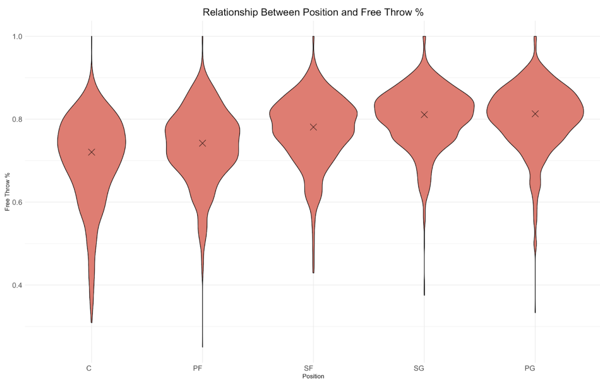
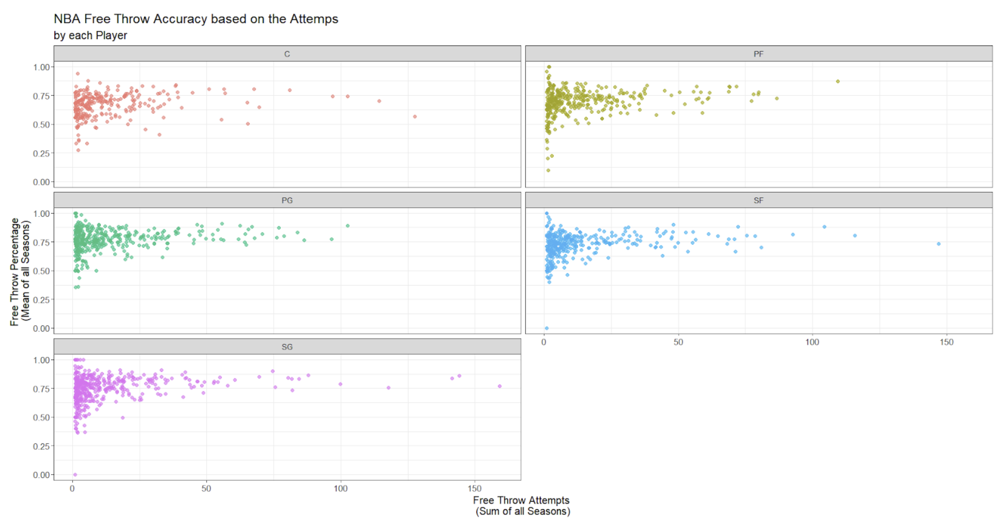
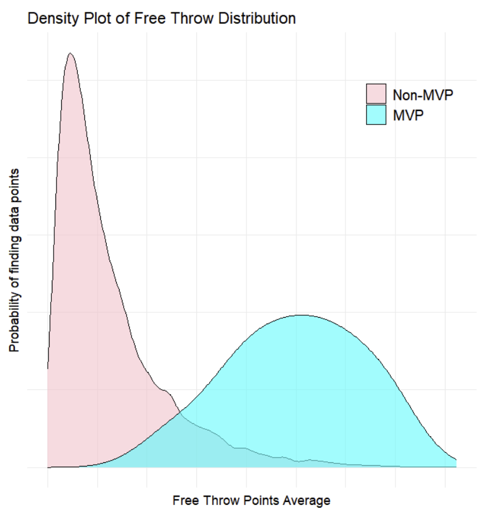

# NBA Free Throw Accuracy
Through data visualizations, this project investigates NBA player statistics from the 1997-98 to the 2021-22 seasons to analyze factors affecting free throw accuracy and its correlation with MVP status in the NBA.

## Data:
[NBA Player Statistics](https://www.kaggle.com/datasets/sadeghjalalian/nba-player-stats-19982022) gathered from Kaggle.

## Key Insights:
- **Positional Influence:** Point Guards and Shooting Guards generally exhibit higher free throw accuracy compared to Centers and Power Forwards.

  

- **Attempts vs. Accuracy:** Surprisingly, a higher number of free throw attempts tends to correlate with a slight decrease in overall accuracy.

  

- **MVP Correlation:** Players who achieve MVP status tend to be more accurate and score more points from free throws compared to non-MVP players, with a noticeable difference in average free throw points.

  

## Key Technologies:
**Language:** R

**Libraries:** dplyr (for data manipulation) and ggplot2 (for data visualization) 

## Full Project Write-up:
For a detailed narrative, comprehensive methodology, and deeper insights into this project, please read the full write-up on [LinkedIn](https://www.linkedin.com/in/gaelmotahernandez/details/projects/1731117327280/single-media-viewer/?profileId=ACoAAD0sr1oBRU-g7rHenPy0sFhxgU6vSvExSdU).

---
